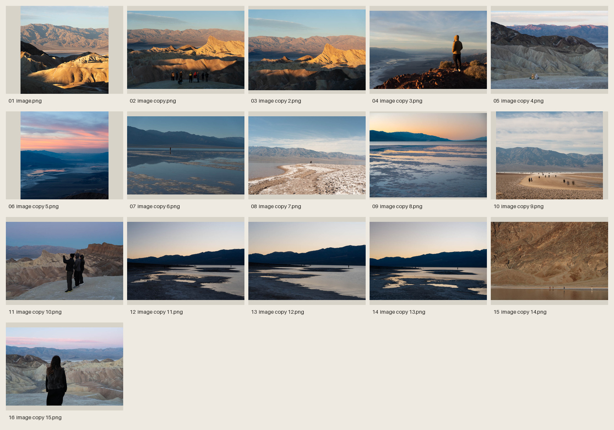
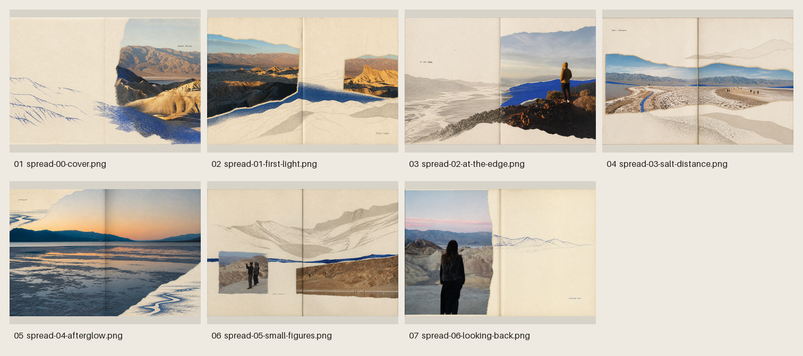

# Create Photo Flipbook UI

A style-neutral Codex skill that turns raw photo collections or finished pages into curated, page-turning photo books using raw HTML, CSS, and vanilla JavaScript.

**[▶ Live Demo](https://haichaolihc.github.io/create-photo-flipbook-ui/)** — Interactive 3D photo flipbook

The skill inspects the collection, chooses compatible visual photo skills, curates the strongest images, designs the sequence and rhythm, generates complete spreads, and assembles the accepted artwork into a responsive 3D flipbook.


## How it works

### 1. Inspect the raw photographs

For larger collections, the agent first creates and actually views an ordered contact sheet. This makes subject repetition, technical problems, visual motifs, and changes in scale or atmosphere legible before any images are selected.



### 2. Choose the visual direction and edit the book

The flipbook engine does not own a house style. It chooses one or more compatible photo skills, reads their full instructions, and lets their visual behavior shape curation, pairing, pacing, and sequence.

The agent then:

- keeps quality above coverage;
- selects photographs that fit the visual direction;
- plans an opener, transitions, pauses, peaks, echoes, and ending when appropriate;
- varies density, scale, contrast, negative space, and emotional temperature;
- preserves one coherent material and visual language across the book.

In this Death Valley example, the agent selected 11 of 16 photographs and used the Gathered Scenes visual grammar.

### 3. Generate and review complete spreads

The outside cover is generated first as one spread—back cover on the left, front cover on the right—followed by every interior spread in reading order. A second contact sheet lets the agent judge the complete book at once and regenerate only clear failures.



This edit produced seven full spreads: one outside cover and six interiors. Their compositions change from spread to spread while paper, color, typography, and photographic treatment remain coherent.

### 4. Assemble the flipbook

Accepted spreads are split only at their intended gutters. The front cover becomes the first hard leaf, the back cover becomes the final hard leaf, and the interior artwork becomes 12 soft leaves. The bundled runtime adds responsive sizing, page turns, touch, mouse, buttons, keyboard controls, and page-bound spine shadows without rebuilding the artwork in HTML.

## Use it in Codex

Attach a folder of photographs and ask:

```text
Use $create-photo-flipbook-ui to curate these photographs into a coherent photo book.
Choose the visual direction, use only the strongest images, and build the final HTML flipbook.
```

If the inputs are already finished pages and should not be edited, say so explicitly:

```text
Use $create-photo-flipbook-ui to assemble these finished pages as-is.
Do not edit, crop, reorder, or redesign them.
```

## Install from GitHub

```bash
python3 ~/.codex/skills/.system/skill-installer/scripts/install-skill-from-github.py \
  --repo HaichaoLihc/create-photo-flipbook-ui \
  --path skills/create-photo-flipbook-ui \
  --ref main
```

After a tagged release, replace `main` with a version such as `v0.2.0`.

## Repository layout

- `skills/create-photo-flipbook-ui/`: installable Codex skill and reusable HTML runtime
- `examples/v1/`: dependency-free vanilla HTML reference implementation
- `examples/v2/`: React Three Fiber library and reader experiment
- `examples/v3-book/`: reviewed Three.js / Quick FlipBook demonstration
- `docs/images/`: README workflow and result examples
- `evals/cases/`: blinded forward-eval inputs
- `evals/rubrics/`: grader-only scoring rubrics
- `evals/run_eval.py`: isolated Codex eval runner
- `tests/`: repository-level structural checks

The installed skill excludes examples, evals, and repository documentation so Codex only loads the resources needed for the task. The example uses a null Sites project ID so it cannot accidentally target production deployment.

## Validate

```bash
python3 tests/validate_repo.py
node --test examples/v1/test.mjs
node --test examples/v3-book/src/quick-flipbook-contract.test.mjs
```

Preview or run a forward eval:

```bash
python3 evals/run_eval.py hawaii-v1 --dry-run
python3 evals/run_eval.py hawaii-v1
```

See `evals/README.md` for the isolation and grading workflow.

## License

Original code and documentation authored by Haichao Li for this project,
including the installable skill in `skills/create-photo-flipbook-ui/`, are
available under the [MIT License](LICENSE).

Third-party components remain subject to their own license terms and notices.
The adapted experiment in `examples/v2/` and all photographs, videos, and
other media assets are not covered by the project's MIT License unless an
individual file or directory expressly says otherwise.
