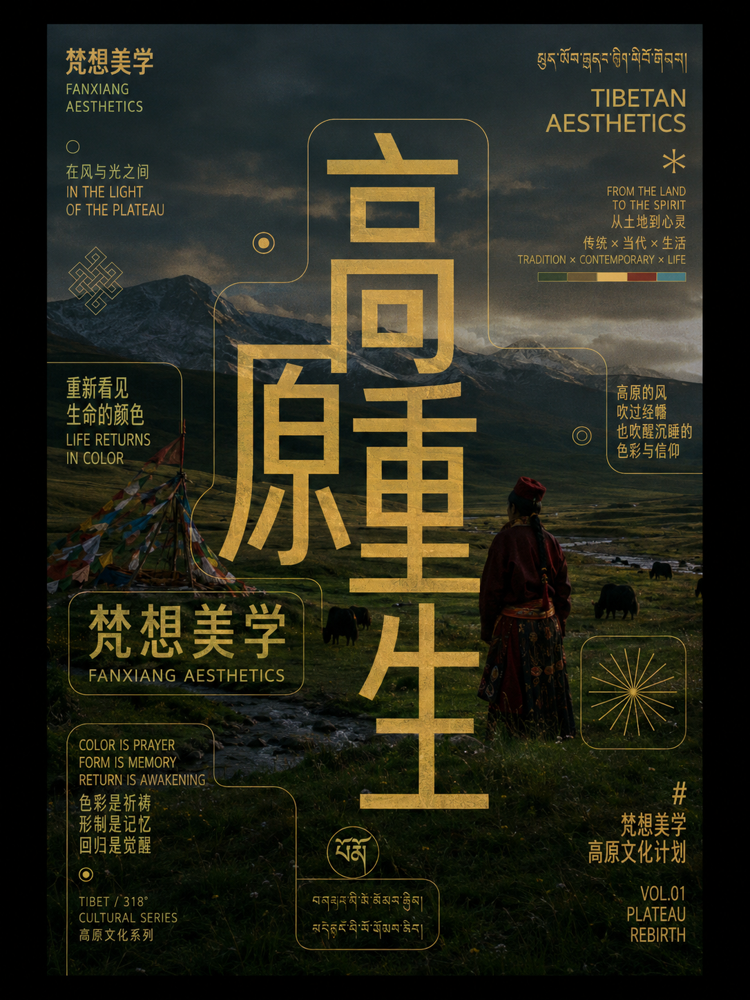
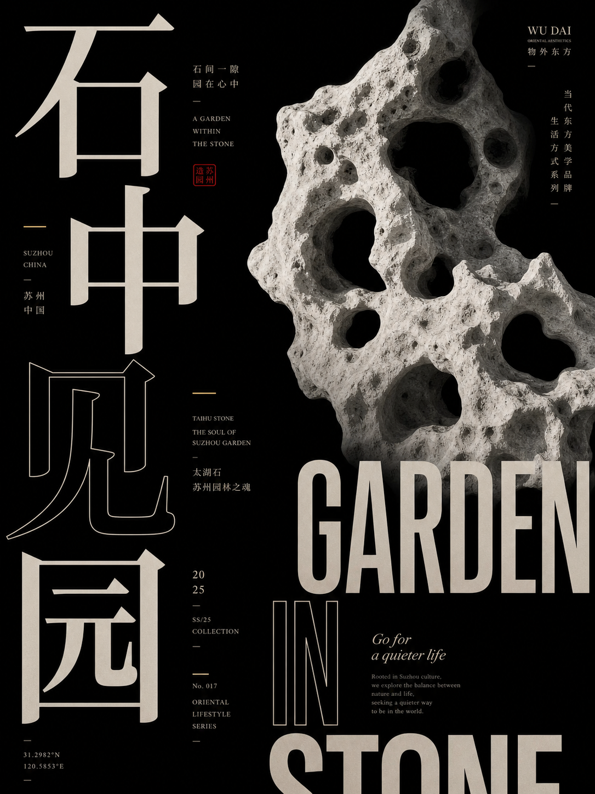
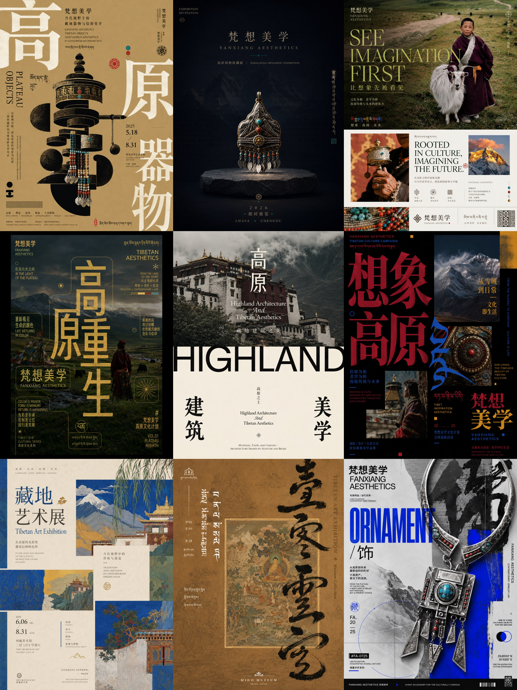

# Culture Fragment Poster Engine

**FANTASY / 梵想美学 · 文化海报与编辑设计**

把文化素材整理成可追溯的视觉线索，再转译成品牌 KV、海报、封面与可执行提示词。

**[快速开始](#start)** · **[下载与安装](#install)** · **[完整规则](SKILL.md)** · **[全部视觉 Skills](https://github.com/dacnay816y62-hub?tab=repositories)**

| 视觉示例 01 | 视觉示例 02 |
| :---: | :---: |
|  |  |

<a id="start"></a>

## 一分钟开始

| 你提供 | 这套 Skill 组织的交付 |
| --- | --- |
| 文化图片、器物、纹样与版式参考 | 素材索引、视觉基因、设计方向与生成提示词 |

```text
用 $culture-fragment-poster-engine 整理这些织物、器物与建筑照片，为一个香氛品牌做文化 KV。先选一个可追溯的材料结构，保留来源依据，给出一个克制的主方向。
```

**生成说明：** Skill 组织设计判断、提示词与执行流程；图片由当前环境中可用的图像工具生成或编辑。示例用于理解视觉方向，具体来源以本仓库记录为准，不能据此保证每次得到相同效果。

<a id="install"></a>

## 下载与安装

**[下载当前分支 ZIP](https://github.com/dacnay816y62-hub/culture-fragment-poster-engine/archive/refs/heads/main.zip)** · **[阅读 Skill 规则](SKILL.md)**

1. 下载并解压仓库。
2. 将仓库根目录（包含 `SKILL.md`）放入当前助手支持的技能目录。
3. 安装文件夹命名为 **`culture-fragment-poster-engine`**，确保入口是 `culture-fragment-poster-engine/SKILL.md`。
4. 在支持技能调用的会话中使用 **`$culture-fragment-poster-engine`**。如果列表未刷新，新开一个任务。

Codex CLI / IDE 的用户级目录是 `~/.agents/skills/`，项目级目录是 `.agents/skills/`；Windows 用户目录可写为 `%USERPROFILE%\.agents\skills\`。以 [OpenAI 官方安装说明](https://learn.chatgpt.com/docs/build-skills#where-codex-loads-local-skills) 为准。ChatGPT 与其他宿主请按各自的技能加载方式使用。

仓库名与调用名可能不同，以上以 `SKILL.md` 中的名称为准。安装不包含图像服务、账户或生成额度；实际出图取决于你使用的环境。

---

## 示例图

这些是用这个 skill 跑出的视觉测试和参考样例，重点展示“文化材料 → 现代海报/KV”的转译结果。

<table>
  <tr>
    <td width="50%"></td>
    <td width="50%"></td>
  </tr>
  <tr>
    <td width="50%"></td>
    <td width="50%"></td>
  </tr>
</table>

参考素材示例：



## 适合做什么

- 整理一整个文化素材文件夹，建立可追溯图片索引
- 从传统纹样、摄影、器物、建筑、非遗、图案中提取视觉基因
- 生成高级文化海报、展览视觉、出版物封面、社媒竖图
- 做奢侈品、香氛、美妆、时装、生活方式品牌的文化 KV
- 把用户喜欢的版式参考转译到新的文化材料上
- 判断哪些宗教、文字、仪式、图像元素不能直接商用
- 生成适合图像模型的精简提示词，而不是冗长分析表

## 核心原则

- **可追溯**：每个视觉判断都要能回到原始文件、来源类型和视觉角色。
- **不混淆事实**：传统文化材料、当代商业再设计和版式参考要分开看。
- **不直接挪用敏感元素**：未知经文、完整神像、仪式图像、宗教符号默认隔离。
- **提取“视觉基因”而不是复制符号**：结构、比例、色彩、材料、节奏、纹理比图案本身更重要。
- **现代高级感优先**：避免旅游纪念品感、满版传统纹样、五色平均分布和廉价国潮拼贴。
- **字体是主视觉资产**：标题、英文、微文案、侧边注释、标签条、坐标和图像窗口都可以成为构图的一部分。

## 目录结构

```text
culture-fragment-poster-engine/
├─ SKILL.md
├─ agents/
│  └─ openai.yaml
└─ references/
   └─ full-rules.md
```

## 使用示例

### 1. 素材文件夹整理

```text
$culture-fragment-poster-engine
帮我整理这个藏地纹样和建筑照片文件夹，建立素材索引，分出核心资产、风险资产、版式参考和可转译的视觉基因。
```

### 2. 高级品牌 KV

```text
$culture-fragment-poster-engine
用这些织物、墙面和器物碎片，做一个高级香氛品牌 KV。不要旅游感，不要满版图案，要更像 Wallpaper* / FRAME / luxury campaign。
```

### 3. 版式参考转译

```text
$culture-fragment-poster-engine
我喜欢这张参考的版式关系，但内容换成苏绣和现代女装。不要照抄坐标，只保留方法。
```

### 4. 直接生成提示词

```text
$culture-fragment-poster-engine
主题：非遗木版年画 × 高级护肤广告
直接给我一条适合图像生成的精简 prompt。
```

## 输出方式

对于大型素材整理，skill 会倾向输出：

- 材料概览
- 图片/关系表
- 核心资产
- 转译方法和版式参考
- 敏感与排除素材
- 标签表

对于单张海报/KV，会倾向输出：

- 任务识别
- 选用材料
- 视觉基因
- 一句话视觉定位
- 图像生成 prompt
- 来源追踪
- 字体修正说明

如果用户要求“直接生成”，分析会尽量内化，直接给出结果、提示词或生产方向。

## 重要文件

- `SKILL.md`  
  主工作流：任务路由、素材索引、文化安全、品牌/KV 模式、排版策略、prompt 压缩和最终检查。

- `references/full-rules.md`  
  详细规则库：分类字段、视觉基因、颜色、藏文/宗教敏感元素、海报路线库和最终检查表。

- `agents/openai.yaml`  
  Codex UI 中展示 skill 时使用的元信息。

## 与普通海报 prompt 的区别

普通 prompt 常常只写“某某文化风格，高级海报，现代排版”。这个 skill 会先把文化材料拆成：

- 来源类型：原始材料、传统材料、商业再设计、版式参考、未知来源
- 可用角色：主视觉、背景、色彩参考、字体参考、纹理、构图、排除项
- 风险等级：可自由转译、需抽象后使用、需验证含义、不能自动商用
- 视觉基因：构图、图形结构、色彩、字体、图像、材质

这样生成出来的方向更像“文化转译后的现代设计系统”，而不是“文化素材贴图”。

## 注意

- 本仓库不包含 API key、账号信息或图像生成额度。
- 文化、宗教、民族文字和仪式图像有语义风险；正式商用前需要人工核验。
- 商业参考图只能学习方法，不能当作文化事实，也不能照抄版式坐标。
- 图像模型不擅长准确文字；中文、英文、藏文、日期、地址和品牌名应在后期排版工具里校正。

## FANTASY / 梵想美学

**让想象先被看见。** 将视觉判断与创作流程整理成可以继续使用的方法。

**[浏览全部视觉 Skills](https://github.com/dacnay816y62-hub?tab=repositories)** · [东方文化编辑海报](https://github.com/dacnay816y62-hub/fantasy-dongfang-jianyuehaibao) · [Chinese Poster Skill](https://github.com/dacnay816y62-hub/chinese-poster-skill)
