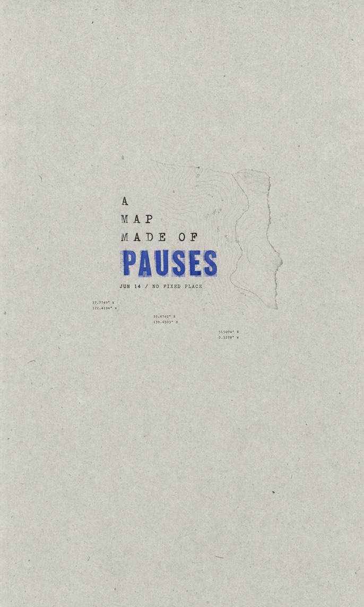

# GC Minimal Zine Poster v0.3.1

**English** · [简体中文](README.zh-CN.md) · [日本語](README.ja.md)

Minimal Zine Poster v0.3.1 is a Codex skill for turning a theme, sentence, article idea, object, mood, photograph, or reference set into a sparse paper-texture editorial poster, a production-ready image prompt, or a reusable visual system.

The callable skill name is `gc-minimal-zine-poster-v0-3`.

## What's New in v0.3.1

- Replaces ambiguous composition wording with concrete focal-element and color-accent language.
- Requires the final image prompt to name the visible carrier, such as a photo crop, paper cutout, ink block, specimen, printed illustration, texture window, or typography.
- Adds quality checks for unrequested maritime symbols and generic pictograms.
- Adds a regression eval for a non-maritime theme with a bright red focal element.
- Keeps Generate, Reference Analysis, Prompt-only, Analyze + Generate, and Photo Input routes unchanged.
- Keeps the callable Skill name `gc-minimal-zine-poster-v0-3` for backward compatibility.

## Visual Direction

The skill compiles each request into a sparse vertical paper poster with:

- a default 3:5 aged-paper canvas
- 70%-90% negative space
- one small imageable subject or visual event
- serif, typewriter, monospaced, or restrained small sans-serif typography
- one clearly visible high-chroma color accent
- xerox, risograph, halftone, letterpress, or scanned-paper defects
- a quiet Japanese/Korean indie-zine or minimal editorial mood

It avoids commercial advertising layouts, glossy mockups, cinematic lighting, 3D rendering, neon, dense scrapbooks, copied reference identity, and long clean text blocks.

## Examples

All six examples below were created by the repository author.

| Night Door | Yellow Step |
| --- | --- |
|  |  |

| Shore Pause | Pause Map |
| --- | --- |
|  |  |

| Typhoon Memory | Moon Tide |
| --- | --- |
|  |  |

## Requirements

- Codex or another compatible Skill runtime.
- Image inspection for reference analysis and quality review.
- Built-in image generation for Generate and Analyze + Generate modes.

The Skill package contains no scripts, external fonts, API keys, private paths, or downloaded runtime assets. Image-generation quality and photo preservation still depend on the model available in the host environment.

## Installation

Clone the current v0.3.1 release into a matching Skill directory:

```bash
git clone https://github.com/LiamGvchi/gc-minimal-zine-poster.git \
  ~/.codex/skills/gc-minimal-zine-poster-v0-3
```

Restart Codex if the Skill does not appear immediately.

## Upgrading from v0.3.0

The callable Skill name and installation directory remain unchanged. If your existing v0.3 installation is a clean Git checkout, update it with:

```bash
git -C ~/.codex/skills/gc-minimal-zine-poster-v0-3 pull --ff-only
```

If the directory is not a Git checkout or contains local edits, install a fresh copy separately and compare your changes before replacing anything.

## Upgrading from v0.1

Do not pull v0.3.1 into an existing `~/.codex/skills/gc-minimal-zine-poster-v0-1` directory. The folder name and the Skill frontmatter name must stay aligned.

Install v0.3.1 beside the old copy using the command above. After confirming v0.3.1 works, you may keep or remove the old directory yourself.

To install the preserved v0.1 release:

```bash
git clone --branch v0.1.0 \
  https://github.com/LiamGvchi/gc-minimal-zine-poster.git \
  ~/.codex/skills/gc-minimal-zine-poster-v0-1
```

## Usage

Generate a poster:

```text
Use $gc-minimal-zine-poster-v0-3 to make a poster about a rainy secondhand bookstore.
```

Analyze references without generating:

```text
Use $gc-minimal-zine-poster-v0-3 to analyze this image folder, separate fixed and variable rules, and return a reusable prompt without copying the source text.
```

Use a supplied photograph as an edit target:

```text
Use $gc-minimal-zine-poster-v0-3 to turn this portrait into a poster. Preserve the person's identity and clothing; change only the layout and paper treatment.
```

Request prompt-only output:

```text
Use $gc-minimal-zine-poster-v0-3 to return only the final image-generation prompt for an old bookstore closing at night.
```

## Request Modes

- **Generate:** content → visual metaphor → prompt → generated raster → inspection.
- **Photo Input:** assign image roles and preservation levels, pass the actual target image into generation, and inspect source preservation.
- **Reference Analysis:** inspect real files and return observed evidence, fixed rules, variable rules, sample residue, a reusable prompt, and limitations.
- **Prompt-only:** return a final four-paragraph prompt and recipe without claiming an image was generated.
- **Analyze + Generate:** extract a visual system first, then generate a new composition without copying a source layout.

## Output

Generation requests return:

1. the generated raster poster
2. the final image-generation prompt
3. the selected recipe
4. a short interpretation note
5. photo role and preservation details when a photograph is supplied

Reference-analysis requests return the evidence-based visual system and reusable prompt without generating an image unless generation was also requested.

## Repository Structure

- `SKILL.md`: request routing and execution workflow
- `references/style-system.md`: fixed identity, variables, color, subject logic, and anti-identity
- `references/prompt-compiler.md`: prompt field order and four-paragraph compiler
- `references/variation-engine.md`: layout and variation recipes
- `references/reference-analysis.md`: evidence and synthesis protocol
- `references/quality-gate.md`: generation, reference-analysis, and prompt-only checks
- `agents/openai.yaml`: Codex UI metadata
- `evals/evals.json`: reusable evaluation prompts
- `examples/`: six author-created poster examples
- `LICENSE`: MIT license

## Acknowledgements

Thanks to Xiaohongshu user **@李李** for reporting that an abstract composition term could be interpreted literally and introduce an unintended nautical icon. This feedback led directly to the v0.3.1 terminology, prompt-compiler, quality-gate, and regression-eval fixes.

## License

MIT. See [LICENSE](LICENSE).
